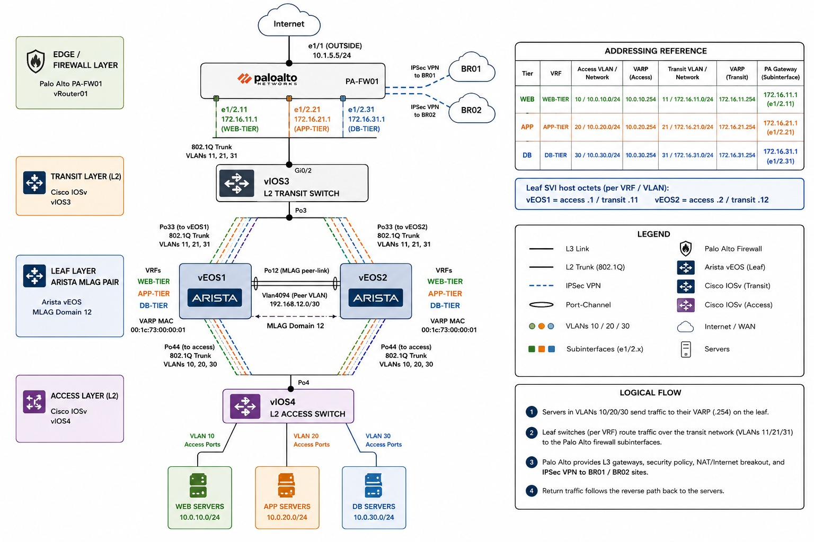

# Multi-Tier Arista MLAG Fabric — Ansible Deployment

End-to-end Ansible automation for the multi-vendor data-centre fabric:
two Arista vEOS leaves in an MLAG pair (per-tier VRFs + VARP), two Cisco IOSv
L2 switches (transit + access), and a Palo Alto edge firewall (L3 gateways,
NAT, internet breakout, and the BR01/BR02 site-to-site IPSec VPNs).

All device configs are transcribed from the live running-configs, so a run is
idempotent — `--check` should report no changes against the existing kit.

```
              Internet
                 │
        ┌────────┴────────┐
        │  Palo Alto PA   │  e1/1 OUTSIDE 10.1.5.5/24  +  IPSec to BR01/BR02
        │  e1/2.11/.21/.31│  172.16.{11,21,31}.1  (tier gateways, vRouter01)
        └────────┬────────┘
                 │  trunk VLAN 11,21,31
            ┌────┴────┐
            │  vIOS3  │  L2 transit (Po3)
            └────┬────┘
        Po33 ────┴──── trunk VLAN 11,21,31
   ┌──────────┐     ┌──────────┐
   │  vEOS1   │═════│  vEOS2   │  MLAG domain 12, Po12/Vlan4094 192.168.12.0/30
   │  (leaf)  │ MLAG│  (leaf)  │  VARP .254, per-tier VRFs (WEB/APP/DB)
   └──────────┘     └──────────┘
        Po44 ────┬──── trunk VLAN 10,20,30
            ┌────┴────┐
            │  vIOS4  │  L2 access (Po4)
            └────┬────┘
       VLAN10/20/30 access ports
        WEB / APP / DB servers (10.0.{10,20,30}.0/24)
```
## Architecture


## What gets configured

| Device   | Collection            | Method                | Highlights |
|----------|-----------------------|-----------------------|------------|
| vEOS1/2  | `arista.eos`          | `eos_config` + template | MLAG 12, VARP `00:1c:73:00:00:01`, VRFs WEB/APP/DB, per-VRF default routes |
| vIOS3    | `cisco.ios`           | `ios_config` + template | L2 transit, Po3 to leaves + Gi0/2 trunk to PA |
| vIOS4    | `cisco.ios`           | `ios_config` + template | L2 access, Po4 to leaves, server access ports |
| pa-fw01  | `paloaltonetworks.panos` | panos_* modules (API) | interfaces+subifs, zones, tags, address objects, VR routes, source-NAT, 9-rule security policy, IKE/IPSec VPN to BR01 (10.1.5.145) / BR02 |

## Addressing reference

| Tier | VRF | Access VLAN/Net | VARP | Transit VLAN/Net | VARP | PA gateway |
|------|-----|-----------------|------|------------------|------|------------|
| WEB | WEB-TIER | 10 / 10.0.10.0/24 | .254 | 11 / 172.16.11.0/24 | .254 | 172.16.11.1 |
| APP | APP-TIER | 20 / 10.0.20.0/24 | .254 | 21 / 172.16.21.0/24 | .254 | 172.16.21.1 |
| DB  | DB-TIER  | 30 / 10.0.30.0/24 | .254 | 31 / 172.16.31.0/24 | .254 | 172.16.31.1 |

Leaf SVI host octets: vEOS1 access `.1` / transit `.11`; vEOS2 access `.2` / transit `.12`.

## File layout
```
ansible.cfg                inventory.ini            requirements.yml
site.yml                   <- runs all four layers in order
pa-fw01.yml                <- full Palo Alto build (imported by site.yml)
group_vars/all/main.yml    <- VLANs / subnets / VRFs / MLAG (single source of truth)
group_vars/all/vault.yml   <- secrets (ENCRYPT THIS)
group_vars/arista_leaf.yml group_vars/ios.yml       group_vars/palo_alto.yml
host_vars/{veos1,veos2,vios3,vios4,pa-fw01}.yml
templates/{veos,vios3,vios4}.j2
```

## Prerequisites
```bash
ansible-galaxy collection install -r requirements.yml
pip install pan-os-python            # required by the panos modules
```

## Configure before running
1. **Management IPs** — edit `inventory.ini` (192.0.2.x are placeholders for the
   switches; pa-fw01 is 10.1.5.126).
2. **Credentials** — put real values in `group_vars/all/vault.yml`, then:
   ```bash
   ansible-vault encrypt group_vars/all/vault.yml
   ```
3. Confirm the per-host interface members in `host_vars/` match your cabling.

## Run
```bash
# Preview everything — no changes pushed
ansible-playbook site.yml --ask-vault-pass --check --diff

# Deploy the whole fabric (switch order: leaves -> transit -> access -> firewall)
ansible-playbook site.yml --ask-vault-pass

# A single layer
ansible-playbook site.yml --ask-vault-pass --limit arista_leaf
ansible-playbook site.yml --ask-vault-pass --limit ios_dist
ansible-playbook site.yml --ask-vault-pass --limit ios_access

# Just the firewall
ansible-playbook pa-fw01.yml --ask-vault-pass
```

Quick check that variables resolve for a host of each type:
```bash
ansible-inventory --host veos1
ansible-inventory --host pa-fw01
```


## Notes & assumptions
- Switch configs are pushed with `save_when: modified` (idempotent); the firewall
  commits via the API at the end (toggle with `do_commit`).
- Local Cisco port-channels (Po3 / Po4) are independent of the vEOS MLAG
  port-channels (Po33 / Po44) — they do not need to match across the link.
- VLANs are not pushed to the vIOS switches: their running-configs keep VLANs in
  the database (vlan.dat), not running-config, so pushing `vlan` stanzas would
  churn. On a fresh switch, create VLANs 11/21/31 (vIOS3) and 10/20/30 (vIOS4) first.
- The IPSec PSK lives in the vault (`vault_psk`); the encrypted blob in the
  firewall's running-config can't be reused, so the plaintext key is supplied here.
- Tag colours are cosmetic (friendly names used, not the raw colorNN IDs).
- `panos_nat_rule` / `panos_security_rule` argument names occasionally shift across
  collection versions; if one errors, check `ansible-doc` for your installed
  version (>= 2.20 assumed in requirements.yml).
- Run `--check --diff` against one device of each type before a full rollout.

## Suggested verification after deploy

## Verify all except br01
```bash
cd multiiter-fabric-ansible
ansible-playbook verify.yml --ask-vault-pass
```

```bash
# Arista MLAG + VARP
ansible arista_leaf -m arista.eos.eos_command \
  -a 'commands="show mlag,show ip virtual-router,show vrf"' --ask-vault-pass
# Palo Alto VPN
ansible palo_alto -m paloaltonetworks.panos.panos_op \
  -a 'provider="{{ provider }}" cmd="show vpn ipsec-sa"' --ask-vault-pass
```
